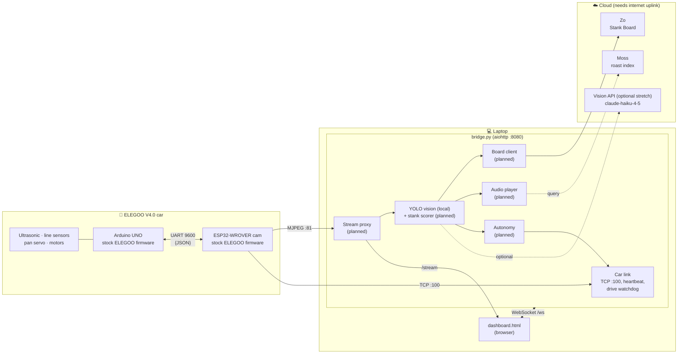
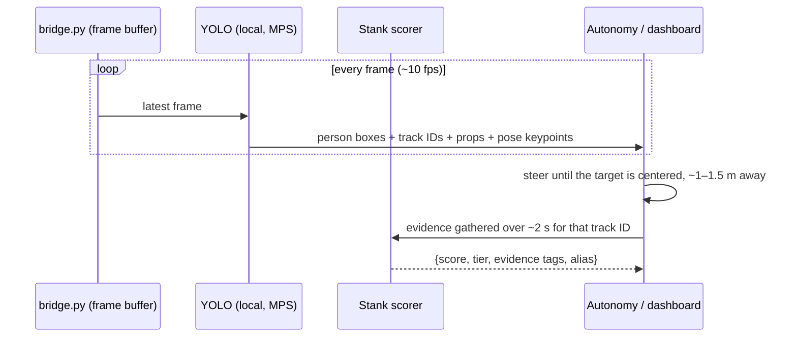
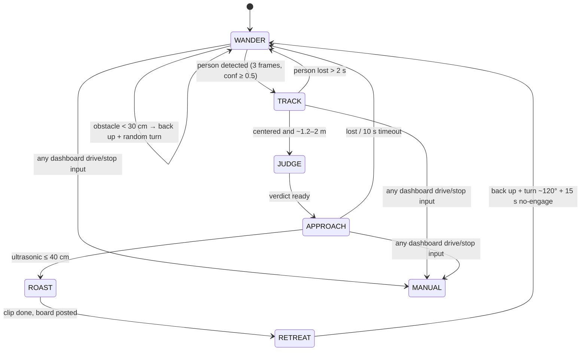

# Lightning McShower: Technical Design

Status: draft for Shower Hacks, Sep 26 2026 (deadline 7:00 pm). The design builds on the code already in the repo: [`bridge.py`](../bridge.py) + [`dashboard.html`](../dashboard.html). Anything marked **VERIFY** hasn't been confirmed on our actual car yet.

## Contents
1. [Architecture](#architecture)
2. [What exists today](#what-exists-today)
3. [Communication protocol (verified against ELEGOO source)](#communication-protocol)
4. [Camera stream: one viewer only](#camera-stream-one-viewer-only)
5. [Networking: the no-internet problem](#networking-the-no-internet-problem)
6. [Vision pipeline](#vision-pipeline)
7. [Scoring](#scoring)
8. [Audio pipeline](#audio-pipeline)
9. [Conversational AI layer (stretch)](#conversational-ai-layer-stretch)
10. [Autonomy (driving model)](#autonomy-driving-model)
11. [Sniff module: BME688 (stretch)](#sniff-module-bme688-stretch)
12. [Sponsor integrations](#sponsor-integrations)
13. [Repo structure](#repo-structure)
14. [Config](#config)
15. [Known risks & mitigations](#known-risks--mitigations)
16. [Privacy & safety](#privacy--safety)

---

## Architecture

The **laptop is the brain**, and **`bridge.py` is the hub**. It owns the single TCP link to the car, the single camera stream, and the WebSocket to the dashboard. New features (vision, audio, autonomy, board) plug into the bridge as modules rather than running as separate processes that fight over the car.



## What exists today

### `bridge.py` (aiohttp, Python)
- **Car link:** connects to `192.168.4.1:100` with a 5 s timeout and reconnects every 2 s. The read loop splits `{…}` frames, and 5 s of silence means the car is gone.
- **Heartbeat:** echoes every `{Heartbeat}` ✅ (required, see below).
- **Driving:** `drive(dir, speed)` sends the **N=102 "rocker"** command with 8 directions (`forward=1, back=2, left=3, right=4, forward_left=5, back_left=6, forward_right=7, back_right=8`). `stop()` sends **N=100**.
- **Safety watchdog:** if no drive update arrives for **0.5 s**, it sends stop. When a dashboard WebSocket closes, it sends stop.
- **Sensor polling:** ultrasonic (`N=21, D1=2`, tag `dist`) every 0.3 s. Line sensors (`N=22`, tags `L0..L2`) every ~0.9 s.
- **Camera direction:** `look(offset)` takes degrees from forward (negative = left) and sends `N=5, D1=1, D2=PAN_CENTER - offset`, clamped to 10–170°. The camera re-centers on every (re)connect. `PAN_CENTER` (default 90) is the calibration knob.
- **Voice clips:** `GET /api/clips` lists audio files in `clips/` (`.m4a .mp3 .wav .aac .ogg .caf`). `POST /api/clips` takes multipart uploads (≤ 50 MB, sanitized names, never overwrites). `/clips/<name>` serves the files.
- **Serves** `dashboard.html` at `/`, and uses `/ws` for state push + commands. Messages from the browser look like `{"type":"drive","dir":…,"speed":…}`, `{"type":"stop"}` and `{"type":"pan","angle":…}`.

### `dashboard.html` (no external deps; works offline)
- The camera `` points **directly** at `http://192.168.4.1:81/stream`.
- Drive pad with hold-to-drive (resent every 150 ms), WASD/arrows with diagonals, `Space` = stop, stop on window blur.
- Speed slider (60–255), and a pan slider (0–180°, debounced 80 ms).
- Distance meter + line sensor readouts.
- **"Tell them to shower"** has a *Reminder voice* toggle:
  - **My recordings** (default) plays a random clip from `clips/` in the browser, avoiding an immediate repeat. Clicking a clip chip plays that one.
  - **Computer voice** uses browser `speechSynthesis` with 6 built-in phrases or custom text. It's also the fallback when there are no clips.
- **Upload:** an *Add files* button, or drag-and-drop anywhere on the page.
- The **auto-remind** checkbox fires when distance ≤ N cm, with a 12 s cooldown.

---

## Communication protocol

Verified by reading ELEGOO's source for **both** firmware generations:
- **Original V4.0 firmware** (`SmartRobotCarV4.0_V0_20210104`, in [elegooofficial/ELEGOO-Smart-Robot-Car-Kit-V4.0](https://github.com/elegooofficial/ELEGOO-Smart-Robot-Car-Kit-V4.0)). This is almost certainly the lineage on our car, and `bridge.py` works with it.
- **New v2.1.2 rewrite** ([ELEGOO-Smart-Robot-Car-Kit-V4.0-New](https://github.com/elegooofficial/ELEGOO-Smart-Robot-Car-Kit-V4.0-New)).
- **ESP32 bridge:** `ESP32_CameraServer_AP_20220120` ([source mirror](https://github.com/Toremetal/ESP32_Examples-ESP32-Camera-CameraWebServer)).

> ⚠️ **Don't reflash the UNO to v2.1.2.** In v2.1.2, `N=5` reads `D2` as a uint8 and divides it by 10, so the dashboard's pan slider would break. The original firmware handles `N=5` correctly. Keep the stock firmware.

### Transport
- Laptop ⇄ ESP32 is **TCP `192.168.4.1:100`**. ESP32 ⇄ UNO is UART 9600 baud.
- Frames are **brace-delimited** `{...}`. The ESP32 strips spaces, forwards frames to the UNO, and returns any UNO output that ends in `}`.

### Heartbeat
- The ESP32 sends `{Heartbeat}` every **1 s**, and the client must echo it. After **> 3 missed** replies (~4 s), the ESP32 drops the client and sends `{"N":100}` (stop) to the UNO. It also stops the car when no WiFi stations are connected.
- `bridge.py` already handles this. Any new code must **go through `bridge.py`'s `Car`**, because a second TCP client would fight it.

### Command table (original firmware, i.e. what's on the car)
| N | Meaning | Params | Reply |
|---|---|---|---|
| 1 | Single/both motor(s) | `D1` motor sel · `D2` speed · `D3` dir | `{H_ok}` |
| 2 | Timed car motion | `D1` **1=L 2=R 3=Fwd 4=Back** · `D2` speed · `T` ms | `{H_ok}` at the end |
| 3 | Untimed car motion | `D1/D2` as N=2 | none |
| 4 | Tank drive | `D1` left · `D2` right speed | `{H_ok}` |
| **5** | **Servo angle** | `D1` 1 = pan (Z), 2 = tilt (Y), 3 = both · `D2` angle in degrees. **Snapped to 10° steps and clamped to 10°–170°.** ⚠️ **Blocks the UNO for ~500 ms.** | `{H_ok}` |
| 21 | Ultrasonic | `D1`=1 → `true/false` · `D1`=2 → **cm** | `{H_<value>}` |
| 22 | Line sensor | `D1` 0/1/2 | `{H_<raw>}` |
| 23 | Lifted off ground? | none | `{H_true/false}` |
| **100** | **Stop / standby** | none | `{ok}` (no H) |
| 101 | Built-in modes | `D1` 1 = line, 2 = obstacle, 3 = follow | none |
| **102** | **Rocker drive** | `D1` **1=Fwd 2=Back 3=L 4=R 5=FwdL 6=BackL 7=FwdR 8=BackR 9=stop** · `D2` speed | none |
| 106 | Gimbal step | `D1` 1–5 | none |

**Gotchas:**
- **N=2 and N=102 number directions differently.** Forward is 3 in N=2 and 1 in N=102. `bridge.py` uses N=102 only, so keep it that way.
- **N=102 is latching:** the car keeps moving until told otherwise. The only protections are `bridge.py`'s 0.5 s watchdog and the ESP32 heartbeat. If the bridge process crashes, the OS closes the socket and the ESP32 stops the car. If the laptop's **WiFi drops**, expect up to **~4 s** of coasting (heartbeat timeout).
- **Pan blocks the UNO ~500 ms**, so no drive or ultrasonic replies happen during that time. Don't pan while moving in autonomy. The dashboard debounce is fine for manual use.
- Some original-firmware acks are `{ok}` without the H tag. `bridge.py`'s `REPLY_RE` ignores them, which is correct.

---

## Camera stream: one viewer only

The ESP32 stream server (`:81/stream`) handles **one viewer** reliably. Today the **browser** holds that stream, so Python vision can't also read it.

**Plan: make `bridge.py` the only stream reader.**
1. The bridge opens `http://192.168.4.1:81/stream` once and keeps the latest JPEG frame in memory.
2. It re-serves the frames as MJPEG at `http://localhost:8080/stream`. The dashboard's `STREAM_URL` changes to `"/stream"`, which is a one-line change.
3. Vision reads the in-memory frame directly, with no second connection.

Fallback if proxying is fiddly: leave the browser on `:81/stream`, and have vision poll **`http://192.168.4.1/capture`** (the port-80 server is separate from the stream server) at ~2–5 fps. **VERIFY** that both run together without choking the stream.

Other camera endpoints: `/status` (JSON settings), `/control?var=framesize&val=N` (resize; stock boots at QVGA 320×240). **VERIFY** the VGA index from `/status`.

---

## Networking: the no-internet problem

The stock ESP32 runs its **own WiFi network** (SSID `ELEGOO-<chipid>`, `192.168.4.1`; the source sets no password), and that network has **no internet**. Today's dashboard was built for this: it uses no external fonts or scripts. **Vision is local (YOLO), so the core loop runs offline.** Internet is only needed to load the Moss index at startup, post to the Zo board, and pre-download YOLO weights.

| Option | How | Verdict |
|---|---|---|
| **A. Second uplink** | Mac Wi-Fi → car. Internet via **phone USB tethering** or a **USB-C Ethernet adapter**, moved **above Wi-Fi** in macOS service order. | ✅ **Recommended.** Zero firmware risk, 5 minutes. |
| B. Reflash ESP32 to join a network | Change `WiFi.softAP` → `WiFi.begin` to join a **phone hotspot** (not venue WiFi, which often has client isolation/captive portals). Back up first: `esptool.py read_flash 0 ALL esp32_backup.bin`. | Fallback. ~1 h, and the car's IP changes. |
| C. USB WiFi dongle | Second WiFi card on the Mac | ❌ Poor macOS driver support |

With no internet at all, the demo still works: YOLO scoring runs locally, a random-by-tier line replaces the Moss pick, and board posts queue until the connection returns.

---

## Vision pipeline

*Owner: **unassigned**. This is the core "does this person need a shower?" feature.*

**Decision: vision runs 100% locally with YOLO on the Mac.** No frames leave the laptop, it costs nothing per call, it has no network latency, and the main loop needs no cloud vision API.



### Models (Ultralytics, run in-process inside `bridge.py`)
| Model | Used for | Notes |
|---|---|---|
| `yolo11n.pt` (detect, COCO 80 classes) | **Person** boxes for steering, plus **props** (the "evidence") | Nano size; ~real-time on Apple Silicon at `imgsz=320–480`, `device="mps"` |
| `yolo11n-pose.pt` (pose, 17 keypoints) | Arm/posture comedy cues (e.g. arms raised = "armpit exposure") | Optional second model; run only on the tracked target, or every 3rd frame |
| `model.track(persist=True)` (ByteTrack) | Stable **track IDs** per person while in view | Used for per-person cooldowns, with no face data |

- **Install:** `pip install ultralytics` on **Python 3.12**. Weights download automatically on first run, so **pre-download them while you have internet**.
- **Speed tips:** run at `imgsz=320` on the QVGA stream. Skip frames if inference falls behind; always use the latest frame, never a queue. Optional: `model.export(format="coreml")` for extra speed on the Mac.
- **Licensing:** Ultralytics is AGPL-3.0. That's fine for a hackathon demo, but swap to MediaPipe (Apache-2.0) if this ever ships.

### From detections to a stank score (a comedy heuristic, not science)
YOLO can't smell, and it doesn't judge clothes quality. We build the score from **visible "hackathon evidence"** near the person, collected over ~2 s while the car holds position:

| Evidence (YOLO) | COCO class / cue | Points | Roast tag |
|---|---|---|---|
| Energy drinks / coffee | `bottle`, `cup` near the person box | +8 each (max +24) | `caffeine` |
| Snack stash | `pizza`, `donut`, `sandwich`, `banana`, `hot dog` | +8 each (max +16) | `snacks` |
| Still coding | `laptop`, `keyboard`, `mouse` | +10 | `coding` |
| Living out of a bag | `backpack`, `handbag`, `suitcase` | +6 | `nomad` |
| Doom-scrolling | `cell phone` | +5 | `phone` |
| Napping nearby | `couch`, `bed`, or pose: lying down | +15 | `sleepy` |
| **Arms raised** (pose: wrists above shoulders) | keypoints | +15 | `armpit-alert` |
| Lingering | same track ID in view > 10 s | +5 | `lingering` |
| Base + jitter | per track ID, **seeded** so it's stable | 30 + rand(−10…+10) | |

`score = clamp(sum, 0, 100)` is the number the Stank Board ranks by ("how confident ShowerBot is"). The evidence tags go to Moss to pick a matching roast, and the board shows them ("Evidence: 3× caffeine, laptop, armpit alert"). The joke is that the car shows its (dumb) reasoning.

- **"Near the person":** a prop counts if its box overlaps the person box expanded by 25%.
- **Alias:** the dominant color of the upper half of the person box, taken from OpenCV's mean hue and mapped to a color name. Combined with the track ID, it becomes "**Blue Shirt #4**". It's clothing only.
- **Why score from ~1–1.5 m:** the camera is ~10 cm off the floor, so up close it only sees shins and no props.

### Why this is safer than a cloud VLM
YOLO only outputs object classes, boxes and keypoints. It can't comment on anyone's body, face, skin, gender or age, so there's no prompt to jailbreak and nothing sensitive to filter. The roast lines themselves are pre-written and curated.

### Dashboard overlay
The bridge draws boxes, the track ID and the evidence tags onto the proxied stream (an annotated MJPEG at `/stream`). The demo audience sees exactly what the car "sees."

### Optional add-on: cloud VLM (stretch, off by default)
For richer, outfit-specific roasts later, `VISION_PROVIDER=anthropic` could send one person crop to **Claude Haiku 4.5** (`claude-haiku-4-5`, ~$0.002/call). It would return a description whose score is blended with YOLO's. It needs internet and sends frames off-device, which changes the privacy note, so leave it **off** unless the core loop is done.

---

## Scoring

```
score = yolo_evidence_score                      # 0–100, the Stank Board ranks by this
if sniff available:  score = 0.7 * score + 0.3 * gas_score    # stretch
```

| Score | Tier | Tone |
|---|---|---|
| 0–34 | **Fresh** 🌸 | Compliment ("Smells like a merged PR.") |
| 35–64 | **Questionable** 🧽 | Gentle nudge |
| 65–84 | **Shower Recommended** 🚿 | Playful roast |
| 85–100 | **Code Brown Alert** 🚨 | Big theatrical roast (still about hoodies, not humans) |

The Fresh tier keeps it a bit fun rather than a pile-on.

---

## Audio pipeline

*Owner: Jake (Mac audio output). Voice lines: everyone.*

**Today (✅ built by Ethan):** recorded clips live in `clips/`, and the **browser** plays a random one through the Mac's default output. Computer voice is the fallback.

**Still to do:**
1. **Record the lines.** The team records ~40–80 lines across tiers and topics (Voice Memos → export `.m4a`, then drop them on the dashboard). Name files `<tier>-<topic>-<n>.m4a` (e.g. `shower-caffeine-2.m4a`, `fresh-general-1.m4a`), so tier and topic can be read from the name before any Moss setup exists. Optionally keep line text + tags in `data/roasts.jsonl`, keyed by filename, for Moss.
2. **Speaker picker (Jake).** Playback is in the browser, so the simplest route is the browser's own output selection. Call `HTMLMediaElement.setSinkId(deviceId)` on the dashboard's `Audio` player, and populate a dropdown from `navigator.mediaDevices.enumerateDevices()` (`audiooutput`). Device labels may need a one-time permission prompt. **VERIFY** in the browser you'll demo with, since Chrome/Edge support it best. **Fallback:** play from Python in `bridge.py` with `sounddevice`/`soundfile` (CoreAudio sees paired Bluetooth speakers) and send the device list over the WebSocket. Simplest of all: set the Mac's system output to the Bluetooth speaker.
3. **Smart picking.** Instead of a random clip, pick by the YOLO verdict: the tier from the filename, then the evidence-matched line via Moss ([below](#moss-roast-line-matching)).

**Cooldowns:** a global 12–20 s between lines (the dashboard already has 12 s), no repeat of any of the last 30 lines, and after a roast the car turns away before it can re-engage (see [Autonomy](#autonomy-driving-model)).

---

## Conversational AI layer (stretch)

*Owner: Andrew.*

This layer reacts to live data with *generated* speech: "Oh, you're backing away? Suspicious." It's a stretch goal on top of the recorded clips.
- **Input:** recent events from the bridge (distance changes, YOLO evidence tags and score, whether someone is walking away). This is **text only; no images are sent.**
- **LLM:** Claude Haiku 4.5, with a short system prompt (playful, never about bodies or identity), capped at 1–2 sentences. It needs internet.
- **Output:** macOS `say` (no latency from a TTS API, works with the device picker via a rendered wav).
- **Rate limit:** at most one generated line per ~20 s, and it never interrupts a recorded clip.
- **Sponsor tie-in:** this is a natural place for OpenSwarm or Chatforce if we want a third sponsor.

---

## Autonomy (driving model)

*Owner: Ricky.*



- **Runs inside `bridge.py`** as an asyncio task that calls `car.drive()` / `car.stop()`, so the existing **0.5 s watchdog** protects autonomy too. Autonomy must keep sending drive updates at ≥ 4 Hz or the car stops.
- **Any manual input wins:** a dashboard drive/stop message switches to MANUAL instantly. Add a mode toggle (`Manual` / `Auto`) to the dashboard.
- **Wander:** slow forward. If the ultrasonic reads < 30 cm, back up 0.4 s, then turn for a random 0.3–0.9 s.
- **Track:** `err = (cx − W/2)/(W/2)`. Use `left`/`right` or `forward_left`/`forward_right` pulses when `|err| > 0.15`. Keep the pan at 90° while moving, because the camera and ultrasonic share the pan bracket (**VERIFY**) and panning blocks the UNO.
- **Approach:** ramp speed down with distance. Hard stop at the dashboard's auto-remind distance (default 40 cm).
- **Safety:** a speed cap (e.g. 150), obstacle checks in every state, and the physical power switch.

---

## Sniff module: BME688 (stretch)

*Owner: Scott. It's only worth doing after the vision + audio loop works.*

- **Sensor:** Seengreat BME688 Rev 1.0. It takes **3.3 V or 5 V** (onboard regulator + level shifting), so it can wire straight to the UNO: `5V, GND, SDA(A4), SCL(A5)`. The **address switch defaults to 0x77**, and the shield's MPU6050 is 0x68, so they **don't conflict**. For I2C, leave MISO/ADDR and CS unconnected.
- **Firmware patch:** based on the **original** ELEGOO sketch (`SmartRobotCarV4.0_V0_20210104`; not v2.1.2, see above).
  - Add **Adafruit BME680** (supports the 688's raw gas resistance). **Not** Bosch BSEC2, which is too big for a 32 KB / 2 KB UNO.
  - Add a new command `N=40` → `{H_<gas_ohms>,<temp_x10>,<rh_x10>,<age_ms>}`. Use integers only, because AVR `sprintf` has no `%f`. Sample in the background every ~3 s and reply from a cached value, so a heater cycle never stalls the drive loop.
  - The ESP32 needs no changes, since it forwards any `}`-terminated reply.
- **Flash/RAM:** compile before and after. If flash > 95% or RAM > 75%, trim unused code (the IR remote, line-tracking mode).
- **Signal:** baseline = rolling median while nobody is within 150 cm. Sniff = min of 3 readings at the stop distance. `drop = (R0 − R)/R0`, and 25% maps to gas_score 100.
- **Honesty:** at car height it smells shoes, and breath will register too. Treat it as comedy garnish, weighted at 0.3. Warm the sensor ≥ 15 min before demoing.
- **Mounting:** front bumper, facing forward, away from the battery and motor driver (heat).

---

## Sponsor integrations

*Owner: **unassigned**.*

### Zo: public Stank Board (primary)
- **What:** a public leaderboard ranked by `stank_confidence`, plus a latest-roasts ticker. **No images.**
- **How (recommended):** a small **HTTP service on Zo** (`zo/stank_board/`, e.g. aiohttp or FastAPI + SQLite). It gets a public HTTP Proxy URL (`*.zocomputer.io`) with HTTPS and auto-restart ([Zo services](https://www.zo.computer/docs/services)).
- **Fastest alternative:** ask Zo to generate a **Zo Space** page + API route at `<handle>.zo.space` ([Zo Space](https://docs.zocomputer.com/spaces)). Spaces are private by default, so **make it public**.
- **API:**
  ```
  POST   /api/verdicts          X-Stank-Key: <shared secret>
         {event_id, ts, alias, score, tier, roast_line}
  GET    /api/board?limit=20
  DELETE /api/verdicts/{event_id}    (opt-out)
  ```
  The bridge posts through an **async queue with retry**, so board outages never block the car.
- **Optional:** an end-of-day summary via the Zo API (`POST https://api.zo.computer/zo/ask`, `Authorization: Bearer zo_sk_…`). **VERIFY** that SMS/email is connected on our Zo account.

### Moss: roast-line matching
- `pip install moss` (Python ≥ 3.10) → `MossClient(project_id, project_key)` ([docs](https://docs.moss.dev/docs/reference/python/api)).
- **Index:** `roasts`, one `DocumentInfo` per recorded line. `text` = line + topic tags, `metadata` = `{tier, clip}`, where `clip` is the filename in `clips/`.
- **Startup:** `await client.load_index("roasts")`, after which queries run in-process (sub-10 ms).
- **Query:** `"{tier}: {evidence tags}"` (e.g. `"Shower Recommended: caffeine, coding, armpit-alert"`), `top_k=10`. Filter by tier and recent use in Python, then play the best hit.
- **Fallback:** a random unused line of the right tier.

### Firecrawl: seeding the library
- `pip install firecrawl-py` → `Firecrawl(api_key=…)`, then `.search()` / `.scrape()` return markdown ([quickstart](https://docs.firecrawl.dev/quickstarts/python)).
- Scrape shower puns, hygiene facts and coder one-liners → `data/roasts_raw.jsonl`. Then **curate by hand**, rewriting lines in our voice and cutting anything mean, and **record** the keepers. Credit Firecrawl as the discovery tool.

### Stretch: OpenSwarm / Chatforce
Could power the conversational layer or a multi-judge "jury." Only after the core loop works.

---

## Repo structure

The existing files **stay where they are** (moving them mid-hackathon breaks teammates' commands). New code goes in a package that `bridge.py` imports.

```
Lightning-McShower/
├── README.md                 # pitch, to-build list, quickstart, team
├── bridge.py                 # ✅ car link + dashboard server + clip API (grows: stream proxy, modes)
├── dashboard.html            # ✅ UI + clip playback/upload (grows: speaker picker, mode toggle, verdict card)
├── clips/                    # ✅ recorded voice lines (.m4a/.mp3/.wav)
├── requirements.txt          # aiohttp, opencv-python, ultralytics, anthropic, sounddevice,
│                             #   soundfile, moss, firecrawl-py, python-dotenv
├── .env.example
├── LICENSE                   # MIT
├── showerbot/                # new modules imported by bridge.py
│   ├── camera.py             # stream reader + frame buffer + MJPEG re-serve
│   ├── vision.py             # YOLO detect/pose/track + evidence → stank score
│   ├── roast.py              # Moss query + fallback
│   ├── audio.py              # only if browser setSinkId doesn't work: Python playback
│   ├── board.py              # Zo client (queue + retry)
│   ├── autonomy.py           # driving state machine
│   └── chat.py               # conversational layer (stretch)
├── scripts/
│   ├── scrape_roasts.py      # Firecrawl
│   ├── build_index.py        # Moss
│   └── render_clips.py       # macOS say for gaps
├── data/roasts.jsonl         # curated lines: clip filename, text, tier, tags
├── zo/stank_board/           # Zo-hosted leaderboard
├── firmware/uno/             # sniff patch (stretch), based on original ELEGOO sketch
└── docs/                     # TECHNICAL.md, SPRINTS.md, media/
```

## Config

`bridge.py` currently takes CLI flags (`--car-host`, `--car-port`, `--port`). Keep those, and put secrets in `.env` (never commit it):

| Var | Default | Purpose |
|---|---|---|
| `YOLO_MODEL` | `yolo11n.pt` | Detection weights |
| `YOLO_POSE_MODEL` | `yolo11n-pose.pt` | Empty = skip pose cues |
| `YOLO_IMGSZ` | `320` | Inference size |
| `YOLO_CONF` | `0.5` | Min person confidence |
| `VISION_PROVIDER` | `yolo` | `yolo` (default) \| `anthropic` (optional VLM add-on) |
| `ANTHROPIC_API_KEY` | none | Only for the conversational layer / optional VLM |
| `MOSS_PROJECT_ID` / `MOSS_PROJECT_KEY` | none | Roast matching |
| `FIRECRAWL_API_KEY` | none | Seeding script only |
| `ZO_BOARD_URL` / `ZO_INGEST_KEY` | none | Stank Board |
| `ZO_API_KEY` | none | Optional summary |
| `AUDIO_DEVICE` | system default | Saved from the dashboard picker |
| `MAX_SPEED` | `150` | Autonomy speed cap |
| `SAVE_DEBUG_FRAMES` | `0` | Must be `0` at the demo |

## Known risks & mitigations

| # | Risk | Mitigation |
|---|---|---|
| 1 | Laptop on car WiFi has no internet | Phone USB tether / Ethernet; the core loop is offline-capable (local YOLO, random-by-tier lines, queued board posts) |
| 2 | Camera serves one viewer; browser + vision collide | Bridge proxies the stream; fallback `/capture` polling |
| 3 | Someone reflashes to v2.1.2 → pan breaks | Stay on stock firmware (documented above) |
| 4 | N=102 latches; WiFi drop → up to ~4 s coasting | 0.5 s watchdog; keep speeds modest; operator at the power switch |
| 5 | Pan blocks UNO ~500 ms | Never pan while moving in autonomy |
| 6 | Distance-only auto-remind fires on furniture | Require a person detection too |
| 7 | Low camera sees only legs up close | Judge at ~1.5 m, then approach |
| 8 | YOLO too slow on the Mac next to everything else | `imgsz=320`, nano weights, always use the latest frame, pose every 3rd frame, CoreML export |
| 9 | Mean or sensitive output | YOLO sees only objects/poses; roast lines are pre-written and curated; Fresh tier; operator STOP |
| 9b | Evidence heuristic feels random | Show the evidence tags on the dashboard/board; the joke is the car's "reasoning" |
| 9c | YOLO weights not downloaded before going offline | Pre-download `yolo11n.pt` / `yolo11n-pose.pt` during setup |
| 10 | Battery sag | Spare pack; swap at 5:00 |
| 11 | Python 3.14 default breaks ML wheels | Use Python 3.12 (`uv venv --python 3.12`) |
| 12 | Unowned work (vision, sponsors) slips | Assign owners at the next sync (see SPRINTS) |

## Privacy & safety
- **Consent first:** only approach attendees who opted in (a sign + a verbal OK).
- **No stored faces:** frames stay in memory, `SAVE_DEBUG_FRAMES=0`, and nothing image-derived goes to Zo except a clothing-based alias.
- **On-device vision:** YOLO runs locally, so **camera frames never leave the laptop**. Only text (score, tier, evidence tags, clothing-color alias) goes to Zo. If the optional cloud VLM is ever turned on, update this note.
- **Opt-out:** delete a board entry on request.
- **Physical:** speed cap, stop distance, watchdog, heartbeat, and the power switch.
